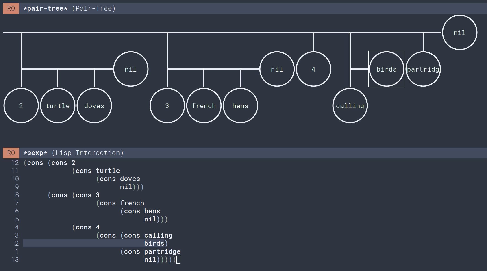

# pair-tree.el

A cons cell explorer.

[](http://www.gnu.org/licenses/gpl-3.0.txt)
[](https://melpa.org/#/pair-tree)

`M-x pair-tree` is a learning tool for visualizing Emacs Lisp lists.

If you're baffled by `cons` and confused by `cdaadr` you might want to give it a spin.

## For example

```el
M-x pair-tree '((2 . (turtle doves)) (3 french hens) 4 (calling . birds) partridge)
```



## Requirements

You will need Emacs 27.1 and svg support. Needless to say, this won't work on a terminal.

## Installation

### Via MELPA

 1. Use the MELPA package repository

   ```el
   (require 'package)
   (add-to-list 'package-archives
                '("melpa" . "http://melpa.org/packages/") t)
   ```

 2. Refresh your packages
 
    ```
    M-x package-refresh-contents
    ```
    
 3. Install `pair-tree`
 
    ```
    M-x package-install pair-tree
    ```
    
#### Via GitHub

Clone this repository and add `pair-tree.el` to your load path:

```el
(add-to-list load-path "/path/to/repo/pair-tree.el")
```

## Usage

Call `M-x pair-tree` and type the list you want to visualise.

You can navigate the tree with the arrow keys. The minibuffer shows the most concise accessor for the focused section.

## Other resources

If you're learning about lists, be sure to read [the GNU Emacs manual](https://www.gnu.org/software/emacs/manual/html_node/elisp/Lists.html#Lists). You may want to check out [dash.el](https://github.com/magnars/dash.el), the excellent list library used in this package.

Racket is an excellent programming language to learn in. If you're using it, take a look at [the Sdraw cons cell visualizer](https://docs.racket-lang.org/sdraw/index.html) instead.
